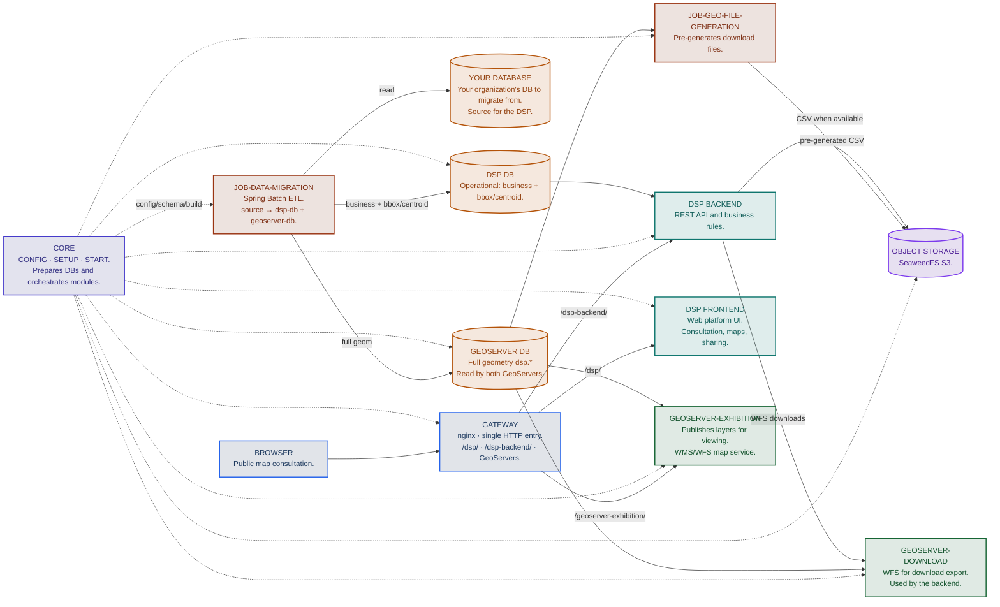

> [!IMPORTANT]
> This README documents the **documentation module** only: how this site is built, edited, and published. It is not the DSP documentation.
>
> To learn about the DSP, open the link below.
>
> **[DSP documentation](https://rural-environmental-registry.github.io/dsp-docs)**
## High-level architecture



## This module

Wiki site for the DSP documentation, published in Portuguese (Brazil) and English. The site root redirects by browser language (`pt*` to `/pt-br/`, `en*` and any other language to `/en/`), with manual links when JavaScript is disabled.

| Language | Path |
|---|---|
| Portuguese (Brazil) | `/pt-br/` |
| English | `/en/` |

### Prerequisites

- Python 3
- pip

### How to run

```bash
git clone https://github.com/Rural-Environmental-Registry/dsp-docs.git
cd dsp-docs
python3 -m venv .venv
source .venv/bin/activate
pip install -r requirements.txt
```

No Windows (PowerShell):

```powershell
python -m venv .venv
.\.venv\Scripts\Activate.ps1
pip install -r requirements.txt
```

Gere o site e sirva a pasta `site/`:

```bash
./scripts/build-site.sh
cd site
python3 -m http.server 8000 --bind 127.0.0.1
```

Abra [http://127.0.0.1:8000/pt-br/](http://127.0.0.1:8000/pt-br/). Para parar, encerre o processo no terminal.

Não rode `zensical build -f zensical.pt-br.toml` direto nos TOMLs fonte. O `site_url` usa o placeholder `__DOCS_PAGES_BASE__` e o HTML sai quebrado. O `build-site.sh` e o CI passam por `scripts/resolve-zensical-config.sh`.

Live reload de um idioma, sem o seletor de idioma:

```bash
./scripts/serve-one-locale.sh pt-br
# ou
./scripts/serve-one-locale.sh en --open
```

Abra [http://127.0.0.1:8000](http://127.0.0.1:8000). O conteúdo fica na raiz, sem o prefixo `/pt-br/`.

`zensical.toml` equivale a `zensical.pt-br.toml`.

### Editing

1. Ative o ambiente: `source .venv/bin/activate`
2. Rode `./scripts/serve-one-locale.sh pt-br` (live reload) ou `./scripts/build-site.sh` e sirva a pasta `site/`
3. Edite o Markdown em `docs/pt-br/` e/ou `docs/en/`
4. Ajuste a navegação no `zensical.pt-br.toml` ou `zensical.en.toml` correspondente

GPL-3.0 — Rural Environmental Registry

<small><strong>Copyright © 2026 Government of Brazil — Ministry of Management and Innovation in Public Services</strong></small>
