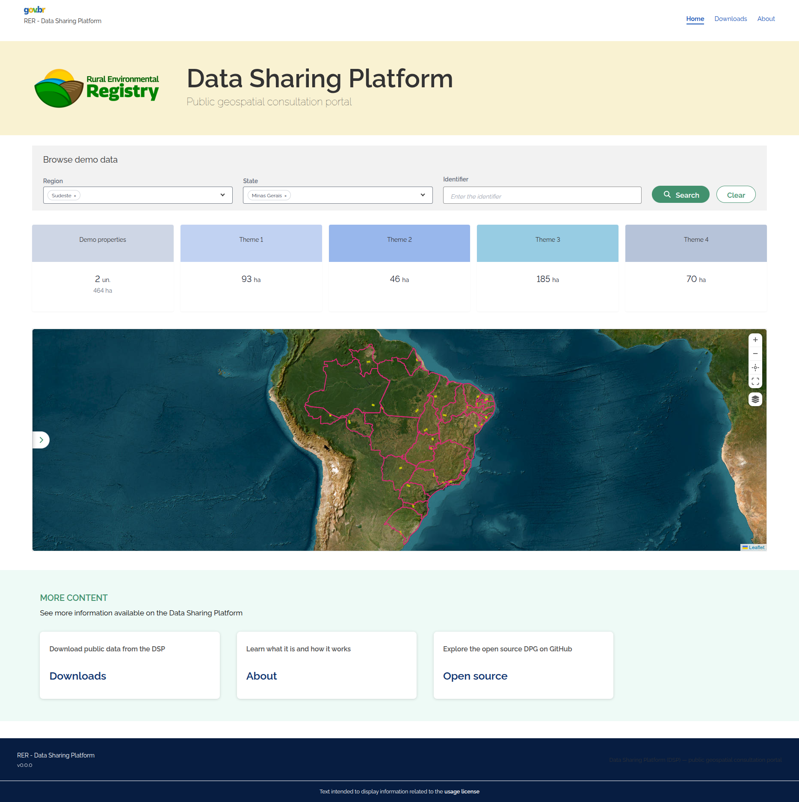

# Quick start (local demo)

## How do I try the system quickly?

This guide is **only to see the DSP running** on your machine: it starts a local demo with a synthetic Brazil seed (sample data on the map), without connecting any database from your organization. You browse the site, explore filters, KPIs, and the map — the fastest path to **get to know the UI**, not to publish or migrate real data.

!!! warning "Installation with real data"
    To **install and configure with real data**, use [Full installation](full-installation.md).

## Prerequisites

| Tool | Version |
|------------|--------------------|
| Git | if sibling repositories are not cloned yet |
| Docker | 24+ with Compose v2 |
| Python | 3 |

`dsp-core` orchestrates building other modules via Docker. If a sibling repository is missing, scripts offer to clone it automatically.

## Step 1 — Organize repositories

The DSP is split into **sibling repositories** on GitHub. We recommend creating a `dsp` folder and cloning everything **at the same level**.

The scripts look for each module in this order: first the short folder (`backend`, `frontend`, `job-data-migration`, `job-geo-file-generation`) and, if the code is not there, the folder named after the repository (`dsp-backend`, `dsp-frontend`, `dsp-job-data-migration`, `dsp-job-geo-file-generation`). When both are missing, the automatic download creates the repository-named folder. Automatic publishing in CI keeps using the short folder.

#### Option A — simplest flow (recommended)

Create the folder, clone only the core, and enter it. The `./config.sh`, `./setup.sh`, and `./start.sh` scripts detect missing sibling repositories and offer to clone them automatically next to the core:

```bash
mkdir dsp && cd dsp
git clone https://github.com/Rural-Environmental-Registry/dsp-core.git
cd dsp-core
```

After you accept automatic cloning in the scripts, the typical tree looks like this:

```text
dsp/
├── dsp-core/          ← you work here (config.sh, setup.sh, start.sh)
├── dsp-backend/
├── dsp-frontend/
├── dsp-job-data-migration/
└── dsp-job-geo-file-generation/
```

#### Option B — manual clone

Clone all application repositories as sibling folders inside `dsp`:

```bash
mkdir dsp && cd dsp
git clone https://github.com/Rural-Environmental-Registry/dsp-core.git
git clone https://github.com/Rural-Environmental-Registry/dsp-backend.git
git clone https://github.com/Rural-Environmental-Registry/dsp-frontend.git
git clone https://github.com/Rural-Environmental-Registry/dsp-job-data-migration.git
git clone https://github.com/Rural-Environmental-Registry/dsp-job-geo-file-generation.git
```

Result:

```text
dsp/
├── dsp-core/
├── dsp-backend/
├── dsp-frontend/
├── dsp-job-data-migration/
└── dsp-job-geo-file-generation/
```

## Step 2 — Enter the core

If you are not already inside the core:

```bash
cd dsp/dsp-core
```

Core scripts create `.env` the first time you run setup — you do not need to create that file manually.

## Step 3 — Run setup in demo mode

```bash
./setup.sh
```

On **Step 3/11 — Setup mode**, choose `1` — the text shown by the script is:

```text
  1) Demonstration (built-in Brazil seed, no JDBC)
     Loads demo map data from built-in SQL — no source database or migration job.
     Use when exploring the UI, evaluating the stack, or when you do not have adopter data yet.
```

This prepares local databases (`dsp-db`, `dsp-geoserver-db`), publishes layers on both GeoServers (Exhibition + Download), and applies the demonstration seed. It does **not** connect to your organization's source database (no external JDBC source) and does **not** start the migration job — data comes only from built-in sample SQL in the core.

Wait for `./setup.sh` to **finish completely** (all steps through the end, with a success message in the terminal). Only then go to Step 4 — stopping midway leaves databases or GeoServer incomplete.

## Step 4 — Start the remaining components

```bash
./start.sh
```

`./setup.sh` already prepared databases, GeoServers, and demo data. `./start.sh` starts the rest of the stack — **API (backend)**, **site (frontend)**, and **nginx gateway** (single access port) — using what is already in the databases. It does **not** run the seed or migration job again; it is for turning on the UI and API after the geographic base is loaded.

Wait for `./start.sh` to finish before opening the browser.

## Step 5 — Access the system

With `./start.sh` finished and containers running, open **http://localhost:8026/dsp/** in the browser (or the URL shown in step 5 of `./start.sh` if you changed port/host in `.env`):



*Caption: same public query screen, running locally after `./start.sh` (gateway on the configured port, usually `http://localhost:8026/dsp/`).*

## Next steps

| I want to... | Page |
|----------|--------|
| Understand the full architecture | [Architecture — Overview](../architecture/overview.md) |
| Install with real organization data | [Full installation](full-installation.md) |
| Detail the migration job | [dsp-job-data-migration — Overview](../modules/job-data-migration/overview.md) |
| Understand download pre-generation (real adopter) | [dsp-job-geo-file-generation](../modules/job-geo-file-generation/overview.md) |
